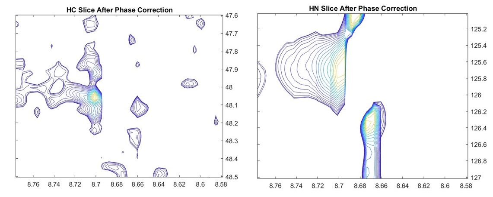

## 9. Processing 3D NMR Spectrum   

In this example we import and process 3D spectrum of a HNCA experiment on GB1. Phase correction was manually applied to all three dimensions interactively. The 0th and 1st order values were chosen by isolating a reference peak as a 3D cube of data and values chosen so that the 1D FID is correctly centered in all three dimensions. Visualizing 3D spectra is difficult, and this was achieved by extracting 2D slices at 1H-13C and 1H-15N dimensions. The impact of phase correction can be seen in these slices, especially in the shoulder peaks in the Carbon domain. These line shapes are dependent on amino acids generating these signals and can be used to assign each residue. 3D NMR plays a critical role in determining protein structure and dynamics. In this example we processed the spectrum, so it is ready for further analysis and backbone assignment of the protein.
This NMR data is kindly provided by Prof. Ilya Kuprov, University of Southampton.  

### Usage

This code can be opened in [MATLAB® Online™](https://matlab.mathworks.com/).

